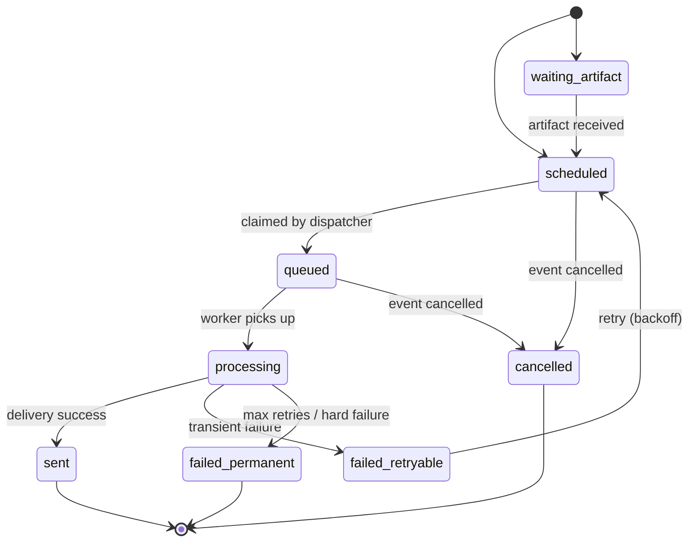

# Alert System

The alert subsystem is the core of what makes Parallax Sports useful: it turns event data into timely notifications delivered through the user's preferred channels.

> [!info] Cross-system view
> This page documents the backend (Spring) side. For the full end-to-end flow including Ktor workers, see [[alert-delivery]]. For the producer-consumer contract, see [[redis-streams-contract]].

## High-level architecture

The system uses a split-responsibility model:

- **PostgreSQL** is the source of truth for alert state and retries.
- **Spring API** is the producer and state manager.
- **Redis Streams** is the transport layer per channel.
- **Ktor workers** are stream consumers and delivery executors.
- **Callback endpoints** in Spring finalize state transitions.

This model provides deterministic state transitions with asynchronous channel delivery.

## End-to-end flow

### 1. Alert generation

Alert rows are generated from event updates and persisted in `user_event_alerts`.

- Compute user/channel eligibility from follow and notification settings
- Compute `send_at_utc` from event start minus lead time
- Write idempotent alerts using `idempotency_key`
- Set initial lifecycle status (`scheduled` or `waiting_artifact`)

### 2. Due-alert dispatch scheduler

A scheduled job runs by cron and dispatches due alerts.

Key mechanics:

- Claim rows with SQL using `FOR UPDATE SKIP LOCKED`
- Claim by channel (`telegram`, `discord`, `email`)
- Only claim rows that are due now (`coalesce(next_retry_at_utc, send_at_utc) <= now`)
- Respect artifact gating — `artifact_required` implies `artifact_id` must exist

### 3. Redis Streams publish (channel strategy)

Claimed alerts are published to channel-specific streams:

- `alerts.telegram.v1`
- `alerts.discord.v1`
- `alerts.email.v1`

Producer payload includes:

- Routing and retry metadata (`alertId`, `channel`, `attempts`, `maxAttempts`)
- Idempotency metadata (`idempotencyKey`)
- Timing metadata (`sendAtUtc`)
- Artifact metadata (`artifactRequired`, optional `artifactId`)
- Enriched event context (event name/type/status/time and optional competition/venue fields)
- Schema version (`schemaVersion=v1`)

### 4. Ktor worker processing

Ktor workers consume Redis Streams by channel consumer groups. See [[redis-stream-consumer]] for the worker-side deep dive.

Expected behavior:

- Consume with at-least-once semantics
- Process delivery for provider/channel
- Callback Spring with status updates
- ACK stream entries only after callback persistence succeeds
- Reclaim stale pending messages after idle timeout
- Route poison messages to DLQ streams

### 5. Callback and lifecycle transitions

Spring callback endpoints receive worker status and artifact notifications.

**Status callback updates:** `processing`, `sent`, `failed_retryable`, `failed_permanent`, `cancelled`

**Artifact callback updates:**

- Persist artifact URL and metadata
- Link artifact to alert
- Move `waiting_artifact` alerts to `scheduled` when requirements are satisfied

**Transition guardrails:**

- Terminal states (`sent`, `failed_permanent`, `cancelled`) cannot transition
- Invalid transitions are rejected as conflict
- Duplicate callback status is treated as no-op
- Duplicate delivery attempt persistence is suppressed by stream-message/outcome check

## Lifecycle model

**Retry behavior:**

- Retries are controlled through `attempts`, `max_attempts`, and `next_retry_at_utc`
- Retry backoff schedule: 1, 3, 10, 30, 120, 480 minutes

## Database model

| Table | Role |
|-------|------|
| `user_event_alerts` | Lifecycle state, retry state, stream metadata |
| `alert_artifacts` | Generated image artifact registry |
| `alert_delivery_attempts` | Immutable attempt history |
| `user_sport_notification_channels` | Per-sport channel defaults |
| `user_follow_notification_channels` | Per-follow channel overrides |

> [!tip] Performance design
> The claim path is index-driven and lock-safe using `SKIP LOCKED` concurrency. The active working set stays compact via retention/archival policies — no materialized views on the hot path.

## Exception handling

The API uses centralized exception mapping (see [[exception-handling]] for the full strategy):

- Domain and integration exceptions map through `GlobalExceptionHandler` to stable `ProblemDetail` responses
- `ProblemDetailResponseAdvice` ensures `type` and `instance` are always present
- Callback and dispatch failures produce consistent contract responses

## Configuration reference

Alert settings are configured under `app.alerts` in `application.yaml`:

- Generation and dispatch toggles
- Dispatch cron and batch size
- Stream names per channel
- DLQ stream names per channel
- Consumer-group names per channel
- Pending-claim idle threshold
- Stream trim enable/max length
- Callback API key and Ktor endpoint settings

## Startup validation

Two startup validators run on application boot:

1. **Schema validator** — checks required tables and columns exist
2. **Stream-contract validator** — validates stream/group/DLQ configuration, logs warnings for blank or duplicate names, logs a per-channel summary table for operations visibility

> [!warning]
> Validators log warnings but do not fail startup. Check logs after deployment.

## Operational checklist

Before enabling dispatch in an environment:

- [ ] Verify `app.alerts.dispatch-enabled=true` only after worker readiness
- [ ] Verify callback API key is set on both sides
- [ ] Verify stream/group/DLQ names match worker configuration
- [ ] Verify Redis connectivity and stream retention settings
- [ ] Verify database indexes and migration status
- [ ] Run a test alert through end-to-end callbacks

## Source map

| Class | Responsibility |
|-------|---------------|
| `UserEventAlertDispatchScheduler` | Cron-triggered claim and dispatch |
| `AlertStreamPublisher` | Redis Streams publish per channel |
| `AlertCallbackService` | Process worker status/artifact callbacks |
| `InternalAlertCallbackController` | Callback REST endpoints |
| `UserEventAlertClaimRepositoryImpl` | SKIP LOCKED claim queries |
| `AlertSchemaStartupValidator` | Schema validation on boot |
| `AlertStreamContractStartupValidator` | Stream config validation on boot |
| `AlertProperties` | Configuration binding |
