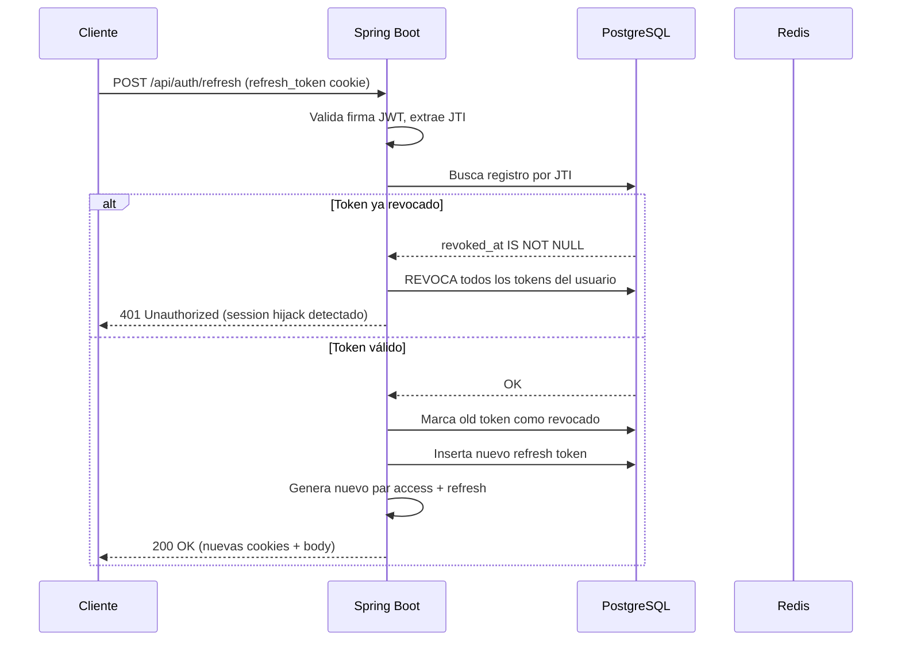

# Autenticación

## Fuentes

- [Spring MVC CORS](https://docs.spring.io/spring-framework/reference/web/webmvc-cors.html)
- [Spring Security: CORS](https://docs.spring.io/spring-security/reference/servlet/integrations/cors.html)
- [Spring Boot: CORS](https://docs.spring.io/spring-boot/reference/web/servlet.html#web.servlet.spring-mvc.cors)
- [Spring Boot: CorsEndpointProperties](https://docs.spring.io/spring-boot/api/java/org/springframework/boot/actuate/autoconfigure/endpoint/web/CorsEndpointProperties.html)
- [JWT con Spring Security – Baeldung](https://www.baeldung.com/spring-security-oauth-jwt)
- [OAuth2 REST API con Angular – Baeldung](https://www.baeldung.com/rest-api-spring-oauth2-angular)
- [Anotaciones personalizadas en Java – Baeldung](https://www.baeldung.com/java-custom-annotation)
- [AOP con anotaciones en Spring – Baeldung](https://www.baeldung.com/spring-aop-annotation)
- [OWASP: HttpOnly](https://owasp.org/www-community/HttpOnly)
- [Spring CORS – Baeldung](https://www.baeldung.com/spring-cors)
- [JWT Revocation – OneUptime](https://oneuptime.com/blog/post/2026-02-02-jwt-revocation/view)
- [How to Invalidate a JWT Using a Blacklist – DEV](https://dev.to/chukwutosin_/how-to-invalidate-a-jwt-using-a-blacklist-28dl)
- [Revoking Access with a JWT Blacklist – SuperTokens](https://supertokens.com/blog/revoking-access-with-a-jwt-blacklist)

---

## JWT

**Algoritmo:** HS256 (HMAC-SHA256). El secreto debe tener mínimo 32 bytes.

### Claims del access token

| Claim            | Valor                |
| ---------------- | -------------------- |
| `sub`            | Email del usuario    |
| `token_type`     | `access`             |
| `role`           | `USER` / `ADMIN`     |
| `email_verified` | boolean              |
| `jti`            | UUID único del token |
| `iat`            | Emitido en (epoch)   |
| `exp`            | Expira en (epoch)    |

- **TTL access token:** 15 minutos.
- **TTL refresh token:** 7 días. Mismos claims pero `token_type=refresh`.

### Entrega de tokens

Los tokens se entregan como cookies **HttpOnly, SameSite=Lax** (Secure configurable por entorno) y también en el cuerpo de la respuesta para clientes que no puedan leer cookies.

`JwtAuthenticationFilter` extrae el token del header `Authorization: Bearer <token>` **o** de la cookie `access_token`.

---

## Rotación de refresh tokens

La tabla `refresh_tokens` almacena `SHA-256(raw_token)` indexado por JTI.

**Flujo de refresco:**



## Revocación híbrida de tokens

Los dos tipos de token se revocan con mecanismos distintos según su vida útil:

| Token   | TTL    | Almacén    | Mecanismo                          |
| ------- | ------ | ---------- | ---------------------------------- |
| Access  | 15 min | Redis      | Blacklist por JTI con TTL residual |
| Refresh | 7 días | PostgreSQL | `revoked_at` + detección de replay |

### Access token: blacklist en Redis

Al hacer logout (o cuando se detecta un incidente de seguridad), `RefreshTokenService.blacklistAccessToken(jti, ttlSeconds)` escribe:

```
SET jwt:blacklist:{jti} "1" EX <segundos_restantes>
```

`JwtAuthenticationFilter` llama a `isAccessTokenBlacklisted(jti)` en cada request autenticado. Si la clave existe → 401, el token se rechaza aunque la firma sea válida.

La entrada expira sola cuando el token habría caducado de todas formas, así que Redis nunca acumula entradas muertas.

### Refresh token: revocación en base de datos

Los refresh tokens se almacenan en `refresh_tokens` como `SHA-256(raw_token)` (nunca el token en claro). La validación comprueba tres condiciones:

1. Registro existe y `revoked_at IS NULL`
2. `expires_at` no ha pasado
3. `SHA-256(raw_token_presentado)` coincide con `token_hash`

En cada rotación (`POST /api/auth/refresh`) el token anterior se marca con `revoked_at = now()` y se emite uno nuevo. Si alguien presenta un token **ya revocado** (replay de token robado), se ejecuta `revokeAllByUser(userId)`: todos los refresh tokens del usuario quedan revocados y las sesiones activas caducan al expirar los access tokens en curso (máximo 15 min).

### ¿Por qué no blacklist en Redis para los refresh también?

Los refresh tokens duran 7 días. Mantenerlos en Redis implicaría entradas con TTL de 7 días por cada sesión activa, más la necesidad de recorrer todas para hacer revocación masiva por usuario. PostgreSQL ya está disponible, soporta `UPDATE WHERE user_id = ?` de forma trivial y persiste los datos en disco, lo que es relevante para un token de larga duración.

---

## OAuth2

### Proveedores configurados

| Proveedor | Scopes              | Userinfo                                                 |
| --------- | ------------------- | -------------------------------------------------------- |
| Google    | `email`, `profile`  | Estándar OIDC                                            |
| Discord   | `identify`, `email` | `https://discord.com/api/users/@me`, atributo `username` |

### Aprovisionamiento de usuario (`OAuthUserProvisioningService`)

- Email coincide con usuario existente → vincula identidad en `user_identities` (no crea usuario nuevo).
- Email nuevo → crea usuario con `email_verified=true`.
- Un usuario puede tener múltiples identidades sociales vinculadas (`user_identities`: clave única compuesta `provider + provider_subject`).

`OAuthService` extiende `DefaultOAuth2UserService`. `OAuth2SuccessHandler` emite el par JWT tras el login OAuth exitoso.

---

## Verificación de email

- Código de 6 dígitos almacenado en Redis: clave `email-verify:{email}`, TTL 10 minutos.
- Límite: máximo 5 intentos fallidos; cooldown de 60 s entre reenvíos.
- Endpoint: `POST /api/auth/verify-email` `{ email, code }`.
- `@RequiresVerifiedEmail` (anotación AOP via `VerifiedEmailAspect`) bloquea operaciones que requieren cuenta verificada.

---

## Cadena de filtros de seguridad

Orden de ejecución antes de Spring Security:

```
BotApiKeyFilter → JwtAuthenticationFilter → Spring Security filter chain
```

### Reglas de acceso

| Ruta                                                                           | Acceso                                     |
| ------------------------------------------------------------------------------ | ------------------------------------------ |
| `/api/auth/register`, `/login`, `/refresh`, `/logout`                          | Público                                    |
| `/api/bot/**`, `/api/formula1/**`, `/api/basketball/**`, `/api/{game}/matches` | Público                                    |
| `/api/internal/alerts/**`                                                      | Público (API key verificada en controller) |
| `/v3/api-docs/**`, `/swagger-ui/**`                                            | Público                                    |
| `/actuator/health`, `/actuator/prometheus`                                     | Público                                    |
| `/actuator/**`                                                                 | Solo ADMIN                                 |
| `/api/admin/**`                                                                | Solo ADMIN                                 |
| Todo lo demás                                                                  | Autenticado                                |

### CORS

Origen único: `APP_FRONTEND_URL`. `credentials=true`. Métodos permitidos: `GET, POST, PUT, PATCH, DELETE, OPTIONS`.
