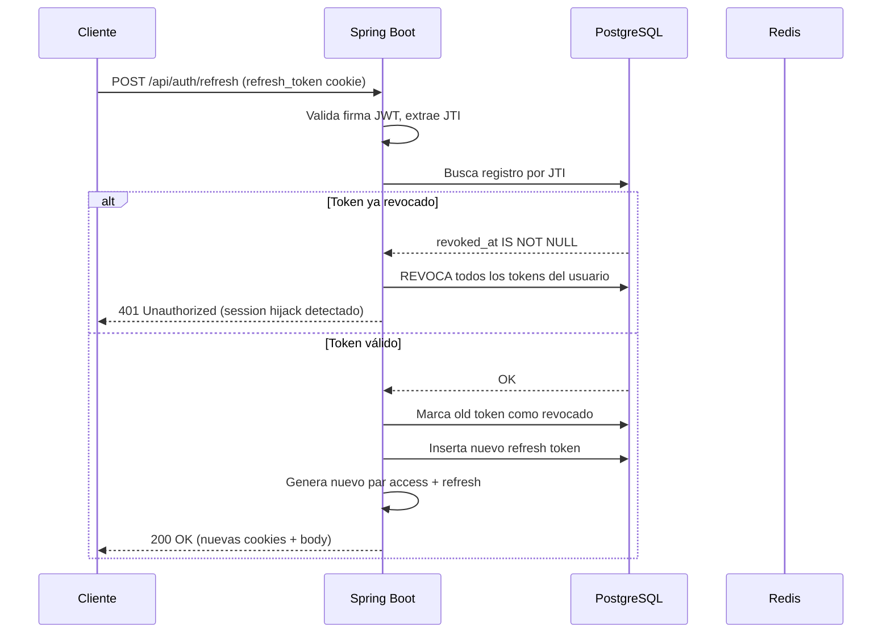

# Autenticación

## JWT

**Algoritmo:** HS256 (HMAC-SHA256). El secreto debe tener mínimo 32 bytes.

### Claims del access token

| Claim            | Valor                |
| ---------------- | -------------------- |
| `sub`            | Email del usuario    |
| `token_type`     | `access`             |
| `role`           | `USER` / `ADMIN`     |
| `email_verified` | boolean              |
| `jti`            | UUID único del token |
| `iat`            | Emitido en (epoch)   |
| `exp`            | Expira en (epoch)    |

- **TTL access token:** 15 minutos.
- **TTL refresh token:** 7 días. Mismos claims pero `token_type=refresh`.

### Entrega de tokens

Los tokens se entregan como cookies **HttpOnly, SameSite=Lax** (Secure configurable por entorno) y también en el cuerpo de la respuesta para clientes que no puedan leer cookies.

`JwtAuthenticationFilter` extrae el token del header `Authorization: Bearer <token>` **o** de la cookie `access_token`.

---

## Rotación de refresh tokens

La tabla `refresh_tokens` almacena `SHA-256(raw_token)` indexado por JTI.

**Flujo de refresco:**



**Revocación de access tokens:** clave Redis `jwt:blacklist:{jti}` con TTL igual al tiempo restante del token. `JwtAuthenticationFilter` consulta esta clave antes de aceptar el token.

---

## OAuth2

### Proveedores configurados

| Proveedor | Scopes              | Userinfo                                                 |
| --------- | ------------------- | -------------------------------------------------------- |
| Google    | `email`, `profile`  | Estándar OIDC                                            |
| Discord   | `identify`, `email` | `https://discord.com/api/users/@me`, atributo `username` |

### Aprovisionamiento de usuario (`OAuthUserProvisioningService`)

- Email coincide con usuario existente → vincula identidad en `user_identities` (no crea usuario nuevo).
- Email nuevo → crea usuario con `email_verified=true`.
- Un usuario puede tener múltiples identidades sociales vinculadas (`user_identities`: clave única compuesta `provider + provider_subject`).

`OAuthService` extiende `DefaultOAuth2UserService`. `OAuth2SuccessHandler` emite el par JWT tras el login OAuth exitoso.

---

## Verificación de email

- Código de 6 dígitos almacenado en Redis: clave `email-verify:{email}`, TTL 10 minutos.
- Límite: máximo 5 intentos fallidos; cooldown de 60 s entre reenvíos.
- Endpoint: `POST /api/auth/verify-email` `{ email, code }`.
- `@RequiresVerifiedEmail` (anotación AOP via `VerifiedEmailAspect`) bloquea operaciones que requieren cuenta verificada.

---

## Cadena de filtros de seguridad

Orden de ejecución antes de Spring Security:

```
BotApiKeyFilter → JwtAuthenticationFilter → Spring Security filter chain
```

### Reglas de acceso

| Ruta                                                                           | Acceso                                     |
| ------------------------------------------------------------------------------ | ------------------------------------------ |
| `/api/auth/register`, `/login`, `/refresh`, `/logout`                          | Público                                    |
| `/api/bot/**`, `/api/formula1/**`, `/api/basketball/**`, `/api/{game}/matches` | Público                                    |
| `/api/internal/alerts/**`                                                      | Público (API key verificada en controller) |
| `/v3/api-docs/**`, `/swagger-ui/**`                                            | Público                                    |
| `/actuator/health`, `/actuator/prometheus`                                     | Público                                    |
| `/actuator/**`                                                                 | Solo ADMIN                                 |
| `/api/admin/**`                                                                | Solo ADMIN                                 |
| Todo lo demás                                                                  | Autenticado                                |

### CORS

Origen único: `APP_FRONTEND_URL`. `credentials=true`. Métodos permitidos: `GET, POST, PUT, PATCH, DELETE, OPTIONS`.

## Fuentes
