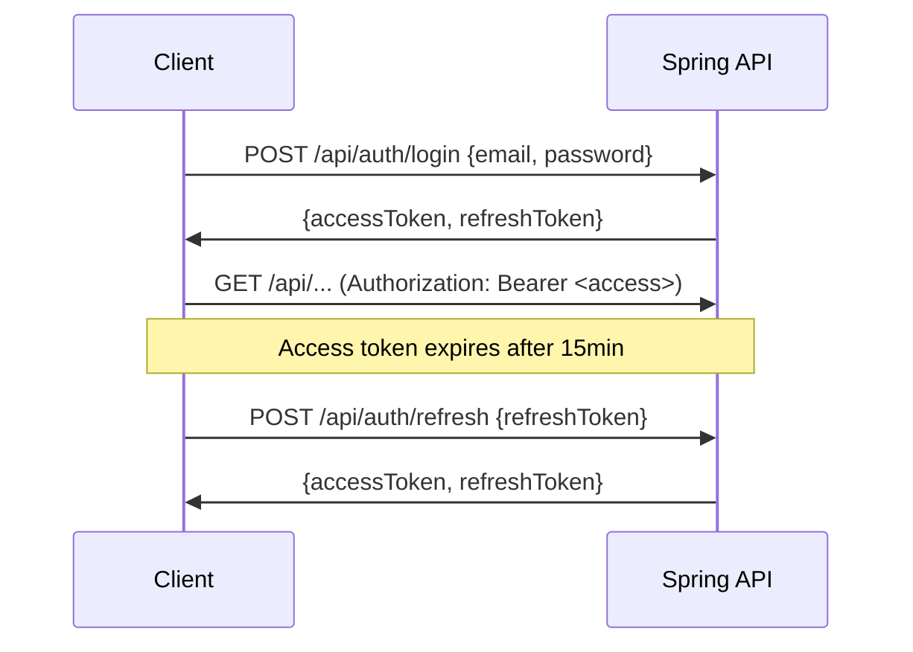

# Authentication

The backend uses stateless JWT authentication with optional OAuth2 social login (Discord and Google). Email verification is required for certain operations.

## JWT token architecture

**Algorithm:** HS256 (HMAC-SHA256)
**Secret:** Minimum 32 bytes, from `JWT_SECRET` environment variable

### Token types

| Token | TTL | Purpose |
|-------|-----|---------|
| Access token | 15 minutes | API authorization via `Authorization: Bearer` header |
| Refresh token | 7 days | Obtain new access tokens without re-login |

### Token claims

| Claim | Value |
|-------|-------|
| `sub` | User email |
| `token_type` | `"access"` or `"refresh"` |
| `role` | User role (`USER`, `ADMIN`) |
| `email_verified` | Boolean |
| `jti` | UUID — unique token ID for revocation tracking |

### Token flow



## OAuth2 social login

Two providers are configured:

| Provider | Scopes | User info endpoint |
|----------|--------|--------------------|
| Discord | `identify`, `email` | `https://discord.com/api/users/@me` |
| Google | `email`, `profile` | Default Google endpoint |

**Flow:** `OAuthService` handles user info retrieval → `OAuthUserProvisioningService` creates or links the user → `OAuth2SuccessHandler` issues JWT tokens.

User identities are stored in `user_identities` (provider + provider_subject), allowing a single user to have multiple social login methods linked.

## Email verification

- Registration creates a user with `email_verified=false`
- Verification email is sent via the [[ms-email]] microservice
- User clicks the verification link → `GET /api/auth/verify?token=...`
- `@RequiresVerifiedEmail` annotation (AOP) enforces verification on protected operations

Scheduled cleanup: `UnverifiedUserCleanupScheduler` removes unverified accounts after a grace period.

## Security filter chain

The filter chain is configured in `SecurityConfig`:

```
Request → BotApiKeyFilter → JwtAuthenticationFilter → Spring Security
```

### Authorization rules

| Path | Access |
|------|--------|
| `/api/auth/register`, `/login`, `/refresh`, `/logout` | Public |
| `/api/bot/**`, `/api/formula1/**`, `/api/basketball/**` | Public |
| `/api/internal/alerts/**` | Public (secured by API key in controller) |
| `/v3/api-docs/**`, `/swagger-ui/**` | Public |
| `/actuator/health`, `/info`, `/prometheus` | Public |
| `/actuator/**` | ADMIN only |
| `/api/admin/**` | ADMIN only |
| Everything else | Authenticated |

### CORS

- Allowed origin: single frontend URL (`FRONTEND_URL`, default: `http://localhost:4200`)
- Methods: GET, POST, PUT, PATCH, DELETE, OPTIONS
- Credentials: enabled
- Max age: 3600 seconds

## Auth endpoints

| Endpoint | Method | Purpose |
|----------|--------|---------|
| `/api/auth/register` | POST | Create account |
| `/api/auth/login` | POST | Email/password login |
| `/api/auth/refresh` | POST | Refresh token rotation |
| `/api/auth/logout` | POST | Revoke refresh token |
| `/api/auth/verify` | GET | Email verification |
| `/api/auth/resend-verification` | POST | Resend verification email |
| `/api/auth/unlink-identity` | DELETE | Remove OAuth provider link |
