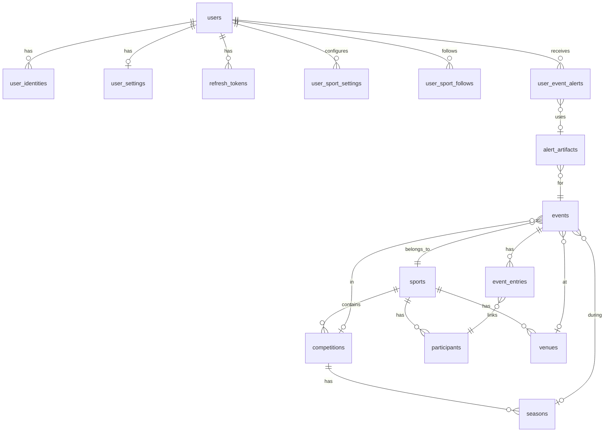

# Data Model

The PostgreSQL schema is organized into five domains: users & auth, sports & events, follows, notifications & alerts, and audit.

> [!info] Conceptual model
> For the conceptual entity hierarchy (Sports → Competitions → Events), see [[domain-model]]. This page documents the SQL-level detail.

## Entity relationship overview

## Users & Authentication

### `users`

| Column | Type | Notes |
|--------|------|-------|
| `id` | bigserial | PK |
| `email` | text | UNIQUE, nullable (OAuth users may not have email initially) |
| `password_hash` | text | nullable (OAuth users) |
| `display_name` | text | nullable |
| `role` | text | CHECK `('USER', 'ADMIN')`, default `'USER'` |
| `email_verified` | boolean | default `false` |
| `created_at` | timestamptz | default `now()` |
| `last_login_at` | timestamptz | nullable |

Partial index: `users_unverified_cleanup_idx` on `(email_verified, created_at) WHERE email_verified = false` — supports the scheduled cleanup of unverified accounts.

### `user_identities`

OAuth provider links. UNIQUE on `(provider, provider_subject)`.

### `user_settings`

One-to-one with users. Theme (`light`/`dark`/`system`), default view (`cards`/`table`/`calendar`), timezone, locale.

### `refresh_tokens`

JWT refresh tokens with `token_hash`, `ip_address` (inet), `expires_at`, `revoked_at`. Partial index on expired+revoked tokens for cleanup.

## Sports & Events

### `sports`

Simple catalog: `key` (unique, e.g., `"formula1"`, `"nba"`), `name`.

### `competitions`

Linked to sport. `kind`: `league`, `tournament`, `series`. Optional `region` and `country`.

### `seasons`

Linked to competition. `name`, `start_date`, `end_date`.

### `venues`

Linked to sport. `kind`: `stadium`, `circuit`, `arena`, `other`. Has `timezone` for display.

### `participants`

Linked to sport. `kind`: `team`, `athlete`, `constructor`, `other`. Has `short_name`.

### `events`

The core entity. Rich with relationships:

| Column | Type | Notes |
|--------|------|-------|
| `sport_id` | FK → sports | CASCADE |
| `competition_id` | FK → competitions | SET NULL |
| `season_id` | FK → seasons | SET NULL |
| `venue_id` | FK → venues | SET NULL |
| `parent_event_id` | FK → events (self) | Hierarchical events (e.g., race weekend → sessions) |
| `event_type` | text | NOT NULL |
| `status` | text | CHECK: `scheduled`, `live`, `finished`, `cancelled`, `postponed` |
| `participants_mode` | text | `none`, `teams`, `field` |
| `external_provider` | text | e.g., `"openf1"`, `"balldontlie"` |
| `external_id` | text | Provider-specific ID |

Deduplication: UNIQUE on `(external_provider, external_id)` where both are NOT NULL.

### `event_entries`

Join table: `(event_id, participant_id)` composite PK. Optional `side` (`home`/`away`/`blue`/`red`) and `display_order`.

### `media_assets`

Polymorphic image storage. `owner_type` (`sport`, `competition`, `participant`, `venue`, `event`) + `owner_id`. Types: `logo`, `icon`, `banner`, `photo`.

## Follows

### `user_sport_follows`

A user follows a specific competition OR participant within a sport. XOR constraint: exactly one of `competition_id` or `participant_id` must be set.

Partial unique indexes ensure a user can't follow the same competition or participant twice within a sport.

### `user_sport_settings`

Per-sport notification defaults: `follow_all`, `event_type_filter` (text array), `notify_default`.

### Notification channel tables

Two levels of channel configuration:

- `user_sport_notification_channels` — per-sport defaults (email/discord/telegram enabled + lead time)
- `user_follow_notification_channels` — per-follow overrides (can override lead time per channel)

## Alerts & Notifications

### `user_event_alerts`

The alert lifecycle table. See [[alerts-system]] for the full state machine.

Key columns: `status` (8 states), `idempotency_key` (UNIQUE), `attempts`/`max_attempts`, `send_at_utc`, `next_retry_at_utc`, `artifact_required`/`artifact_id`.

Optimized indexes:
- `due_claim_idx` — for `SKIP LOCKED` dispatch: `(status, COALESCE(next_retry_at_utc, send_at_utc), id)`
- `waiting_artifact_idx` — for artifact gating
- `terminal_sent_idx` — for archival/reporting

### `alert_artifacts`

Generated images (screenshots). Linked to events. UNIQUE on `(event_id, artifact_type, render_context_hash)` — prevents duplicate artifacts.

### `alert_delivery_attempts`

Immutable audit trail. Each delivery attempt records: `attempt_no`, `channel`, `worker_id`, `outcome` (`success`/`retryable_failure`/`permanent_failure`), `latency_ms`, `provider_message_id`.

## Audit

### `audit_logs`

General audit trail with `actor_user_id`, `action`, `entity_type`/`entity_id`, `detail` (JSONB), `ip_address` (inet), `trace_id`.

## Notable patterns

- **Automatic `updated_at`**: Trigger function `set_updated_at()` applied to 6 tables
- **CASCADE vs SET NULL**: Hard ownership uses CASCADE (user → follows), optional references use SET NULL (event → venue)
- **Conditional uniqueness**: Partial indexes for deduplication (external events, follows)
- **Array types**: `event_type_filter` (text[]) for flexible filtering
- **inet type**: IP address storage in refresh tokens and audit logs
