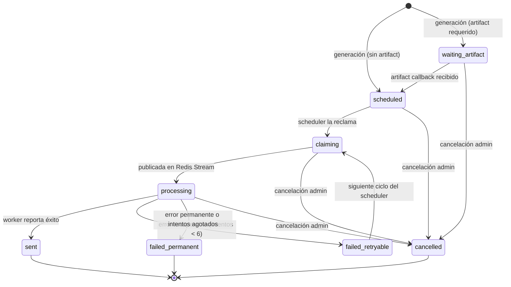

# Sistema de alertas

Pipeline que va desde la ingesta de eventos hasta la entrega al usuario por Telegram, Discord o email.

---

## 1. Generación de alertas

**Clase:** `UserEventAlertGenerationService`

Disparada por `EventsIngestedEvent`, un Spring application event que se publica tras completar cada sincronización. El listener usa `@TransactionalEventListener(phase = AFTER_COMMIT)` para garantizar que los eventos ya están comprometidos en BD.

**Por cada evento ingestado:**

1. Resuelve los pares `(usuario, canal)` elegibles combinando:
   - `UserSportFollow` (seguimientos individuales de competición/participante).
   - `UserSportSettings.follow_all=true` (suscripción a todo el deporte).
2. Por cada par: calcula `send_at_utc = event.start_time_utc - lead_time_minutes`.
3. Hace upsert de `UserEventAlert` usando `idempotency_key` como clave de deduplicación: las re-ejecuciones del sync son seguras.
4. Estado inicial:
   - `scheduled`: alerta lista para despachar.
   - `waiting_artifact`: si `artifact_required=true` y aún no existe `AlertArtifact`.

---

## 2. Scheduler de dispatch

**Clase:** `UserEventAlertDispatchScheduler`

Cron: `0 * * * * *` (cada minuto).

**Proceso:**

1. Reclama alertas con `SELECT ... FOR UPDATE SKIP LOCKED` para evitar procesamiento concurrente entre instancias.
2. Condición de elegibilidad: `COALESCE(next_retry_at_utc, send_at_utc) <= NOW()`.
3. **Artifact gate:** descarta alertas donde `artifact_required=true AND artifact_id IS NULL`.
4. **Alertas Discord:** resuelve routing antes de publicar (`DiscordRoutingResolver` determina DM vs canal de servidor). Si no hay routing resolvible → marca `failed_permanent`.
5. Delega a `AlertStreamPublisher` para cada alerta elegible.

---

## 3. Publicación en Redis Stream

**Clase:** `AlertStreamPublisher`

- Serializa la alerta a `Map<String,String>` (ver [[redis-streams-contrato|Contrato Redis Streams]]).
- Publica en el stream correspondiente al canal: `alerts.discord.v1`, `alerts.email.v1`, `alerts.telegram.v1`.
- Recorta el stream a máximo **200 000 entradas** tras cada publicación (`MAXLEN ~`).
- Si Redis falla:
  - Intento de fallback HTTP a Ktor (opcional, configurable).
  - Si también falla → marca alerta `failed_retryable` con backoff exponencial.

---

## 4. Máquina de estados

**Clase:** `AlertStatusTransitionPolicy`

**Estados terminales** (`sent`, `failed_permanent`, `cancelled`): inmutables, no admiten transición.

| Transición                        | Condición                                                        |
| --------------------------------- | ---------------------------------------------------------------- |
| `waiting_artifact` → `scheduled`  | Callback de artifact recibido con URL válida                     |
| `processing` → `failed_retryable` | Error recuperable, `attempts < max_attempts`                     |
| `processing` → `failed_permanent` | `ProviderPermanentFailureException` o `attempts >= max_attempts` |
| `any` → `cancelled`               | Acción de administrador                                          |

---

## 5. Callbacks de workers

**Clase:** `AlertCallbackService`

Los workers Ktor informan el resultado via HTTP:

- `POST /api/internal/alerts/{alertId}/status`: worker reporta `processing`, `sent` o `failed`.
- `POST /api/internal/alerts/{alertId}/artifact`: worker sube la URL del artefacto generado.

**Callback de artefacto:**

1. Persiste `AlertArtifact` con URL de Cloudinary y hash de contexto de renderizado.
2. Vincula el artefacto a la alerta (`artifact_id`).
3. Mueve la alerta de `waiting_artifact` → `scheduled`.

Para cada resultado terminal se crea un registro `AlertDeliveryAttempt`.

---

## 6. Política de reintentos

**Clase:** `AlertRetryPolicy`

| Parámetro              | Valor                                                               |
| ---------------------- | ------------------------------------------------------------------- |
| `max_attempts`         | 6                                                                   |
| Delay entre reintentos | 15 s (configurado en el worker Ktor)                                |
| Fallo permanente       | `ProviderPermanentFailureException` → sin reintento, ACK y descarte |

El backoff exponencial se calcula en el worker; Spring solo registra `next_retry_at_utc` cuando el worker lo indica en el callback.

## Fuentes
