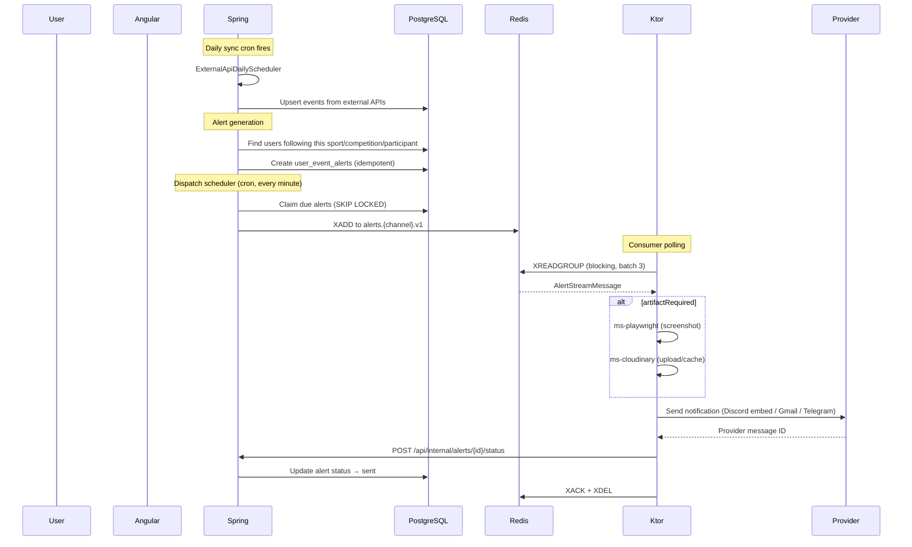

# Alert Delivery Flow

The primary cross-system flow. Traces how a user following a team results in a notification arriving on their phone.

## Sequence

## Step by step

### 1. External data sync

The [[sync-pipeline|daily scheduler]] fetches events from external APIs (OpenF1, Balldontlie, PandaScore) and upserts them into PostgreSQL.

### 2. Alert generation

`UserEventAlertGenerationService` finds users whose follow settings match the synced events:
- Check `user_sport_follows` for matching sport/competition/participant
- Check `user_sport_notification_channels` for enabled channels
- Compute `send_at_utc` = event start - lead time
- Create alert rows with idempotency keys (no duplicates)
- Initial status: `scheduled` (or `waiting_artifact` if the channel requires an image)

### 3. Due-alert dispatch

`UserEventAlertDispatchScheduler` runs every minute:
- Claims alerts that are due now using `FOR UPDATE SKIP LOCKED` (concurrent-safe)
- Groups by channel and publishes to the channel-specific Redis Stream
- Updates status to `queued`

### 4. Ktor worker processing

Each [[redis-stream-consumer|worker]] polls its channel stream:
- Parses the `AlertStreamMessage`
- If `artifactRequired`: calls [[ms-playwright]] → [[ms-cloudinary]] for a screenshot
- Calls the provider (Discord/Gmail/Telegram)
- Reports status back to Spring via callback

### 5. Status callback

Spring receives the callback and transitions the alert:
- `sent` → terminal success
- `failed_retryable` → schedules retry with backoff
- `failed_permanent` → terminal failure

### 6. Cleanup

Worker ACKs the stream message only after Spring confirms the callback. Then DELETEs the message from the stream.

## What touches what

| System | Role in this flow |
|--------|------------------|
| [[sync-pipeline\|Spring sync]] | Creates events from external APIs |
| [[alerts-system\|Spring alerts]] | Generates + dispatches + manages lifecycle |
| [[redis\|Redis Streams]] | Transport layer between Spring and Ktor |
| [[redis-stream-consumer\|Ktor base class]] | Consume, deliver, callback |
| [[ms-discord]], [[ms-email]], [[ms-telegram]] | Provider-specific delivery |
| [[ms-playwright]], [[ms-cloudinary]] | Artifact generation (optional) |
| [[data-model\|PostgreSQL]] | Source of truth for all state |
