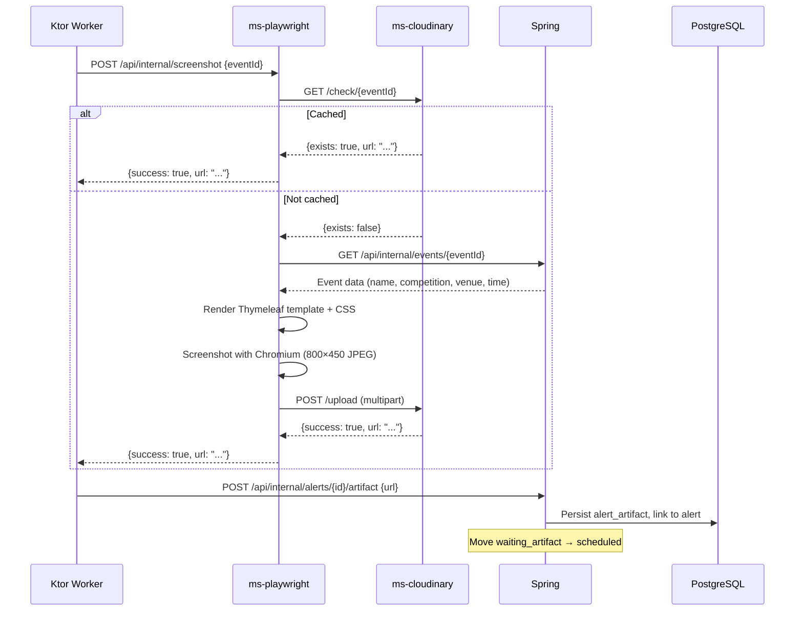

# Artifact Pipeline

When an alert requires a visual artifact (e.g., an event card image for Discord embeds), this pipeline generates and caches the screenshot.

## Sequence

## Components involved

| Service | Role |
|---------|------|
| [[redis-stream-consumer\|Ktor worker]] | Initiates artifact request when `artifactRequired=true` |
| [[ms-playwright]] | Orchestrates screenshot generation |
| [[ms-cloudinary]] | Cache check + persistent storage |
| Spring API | Provides event data + receives artifact callback |

## Concurrency control

A semaphore in the [[redis-stream-consumer|RedisStreamConsumer]] base class limits concurrent Playwright calls to 3. Headless Chromium instances are memory-intensive.

## Caching

Cloudinary acts as the cache layer. Once an event card is generated, subsequent requests for the same event return the cached URL immediately — no browser rendering needed. Uploads are idempotent (`overwrite=true`).
