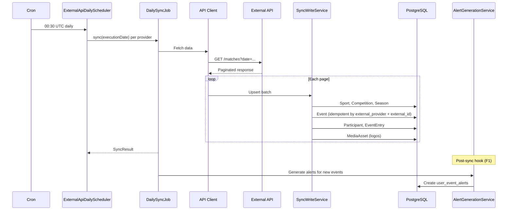

# Data Sync Flow

How event data gets from external sports APIs into the local database.

## Sequence

## Provider differences

| Provider | API | Pagination | Sync window |
|----------|-----|------------|-------------|
| [[sync-formula1\|Formula 1]] | OpenF1 | Full year fetch | Entire year |
| [[sync-basketball\|Basketball]] | Balldontlie | Cursor-based (page budget: 10) | Date window from last sync |
| [[sync-pandascore\|PandaScore]] | PandaScore | Page-based | Two-phase: tournaments then matches |

## Idempotency

Events are deduplicated by `(external_provider, external_id)`. The `SyncWriteHelper.setIfChanged` pattern avoids unnecessary database writes when data hasn't changed.

## Error handling

Each provider runs independently — one failing doesn't block the others. The scheduler aggregates success/failure counts and logs per-provider results.
