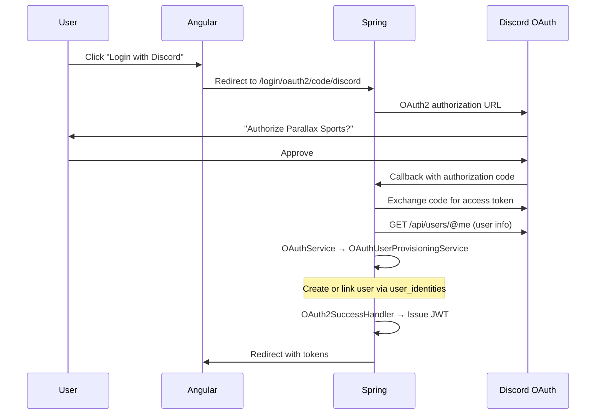

# Discord OAuth Flow

Discord integration works at two levels: web login (OAuth2 via Spring Security) and bot account linking (via the Discord bot slash command).

## Web login (OAuth2)

**Scopes:** `identify`, `email`

The `user_identities` table stores `(provider="discord", provider_subject=<discord_user_id>)`. A single user can have both Discord and Google identities linked.

## Bot account linking

The [[ms-discord|Discord bot]] provides a `/login` slash command:

1. Bot generates a one-time UUID auth token + Discord user ID
2. Sends an ephemeral message with a login URL
3. User clicks the link, which authenticates them in the web app and links their Discord identity

This allows the bot to know which Parallax Sports user corresponds to which Discord user — enabling personalized alert delivery to the correct Discord channel.
