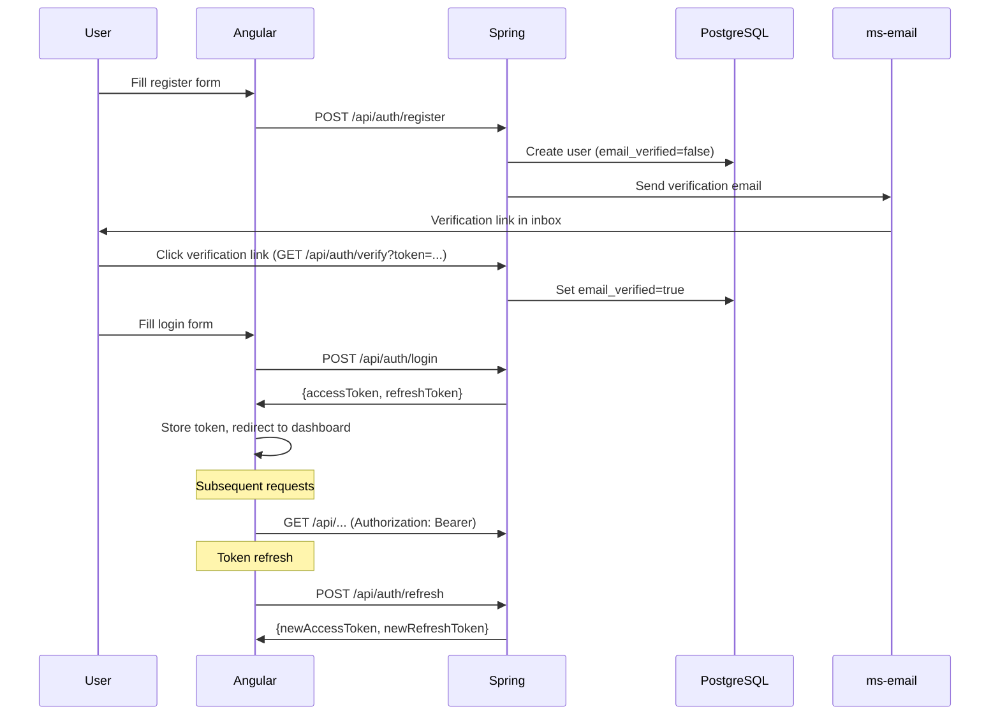

# User Registration Flow

Traces the path from a new user signing up to accessing the dashboard.

## Sequence

## Key details

- **Registration** creates a user with `email_verified=false`. The `@RequiresVerifiedEmail` AOP annotation blocks certain operations until verification completes.
- **Verification email** is sent via the [[ms-email]] microservice using Gmail OAuth2 and Thymeleaf templates.
- **Unverified cleanup**: `UnverifiedUserCleanupScheduler` removes accounts that never complete verification.
- **JWT tokens**: 15-minute access token + 7-day refresh token. See [[authentication]].
- **OAuth2 alternative**: Users can also register/login via Discord or Google OAuth2, which provisions a user automatically via `OAuthUserProvisioningService`.
