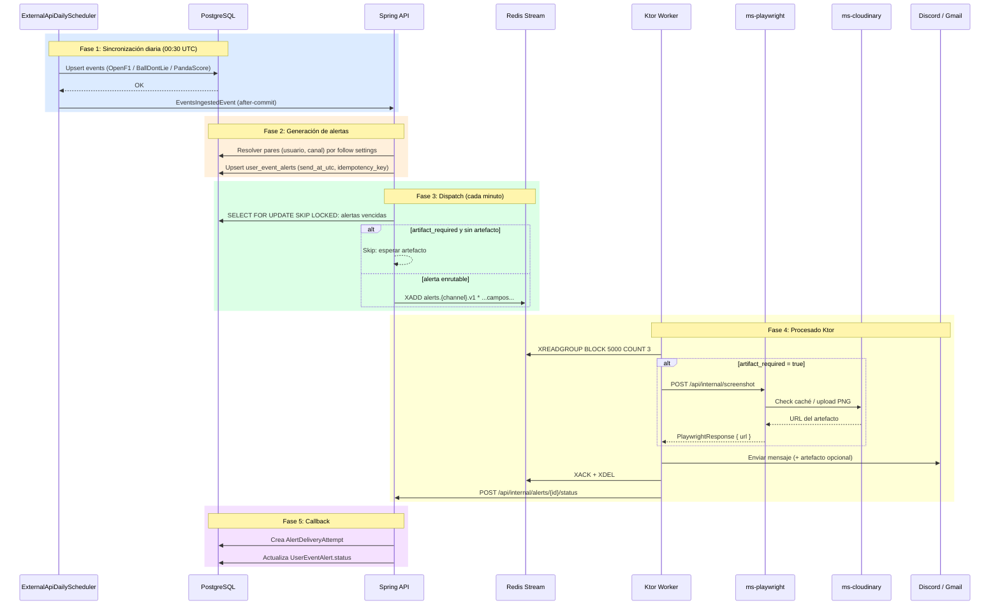

# Entrega de alertas

Flujo completo de cinco fases que va desde la ingesta de datos de APIs externas hasta la confirmación de entrega de una notificación al usuario.

## Actores

| Actor                       | Responsabilidad                                           |
| --------------------------- | --------------------------------------------------------- |
| `ExternalApiDailyScheduler` | Dispara la sincronización diaria a las 00:30 UTC          |
| Angular SPA                 | Interfaz del usuario                                      |
| Spring API                  | Orquestador principal: generación y dispatch de alertas   |
| PostgreSQL                  | Almacenamiento persistente de eventos, alertas y usuarios |
| Redis Stream                | Bus de mensajes (`alerts.{channel}.v1`)                   |
| Ktor Worker                 | Consumidor del stream; llama a providers externos         |
| ms-playwright               | Generación de capturas de pantalla                        |
| ms-cloudinary               | Almacenamiento y caché de artefactos                      |
| Discord / Gmail API         | Entrega final de la notificación                          |

## Diagrama de secuencia

## Fase 1: Sincronización diaria

`ExternalApiDailyScheduler` se ejecuta a las **00:30 UTC** mediante cron `0 30 0 * * *`.

Lanza todos los `ExternalApiDailySyncJob` registrados. Cada job:

- Consulta su API externa (OpenF1, BallDontLie, PandaScore)
- Realiza upsert de events en PostgreSQL
- Devuelve `ExternalSyncExecutionResult` con contadores `upserted / skipped / failed`

Tras el commit de cada job se publica `EventsIngestedEvent` vía `@TransactionalEventListener(AFTER_COMMIT)`.

Ver detalle en [[sincronizacion-datos|Sincronización de datos externos]].

## Fase 2: Generación de alertas

`UserEventAlertGenerationService` escucha `EventsIngestedEvent`.

Para cada evento ingestado:

1. Resuelve los pares elegibles `(usuario, canal)` en función de los follow settings del usuario.
2. Calcula `send_at_utc = event.start_time_utc - lead_time_minutes`.
3. Hace upsert en `user_event_alerts` usando `idempotency_key` para evitar duplicados.

## Fase 3: Dispatch scheduler

`UserEventAlertDispatchScheduler` se ejecuta **cada minuto**.

1. `SELECT FOR UPDATE SKIP LOCKED`: obtiene alertas cuyo `send_at_utc ≤ now()`.
2. Si `artifact_required = true` y no hay artefacto disponible → **skip** (reintentará en el siguiente ciclo).
3. Para Discord: `DiscordRoutingResolver` calcula el destino (DM vs canal de guild). Si no es enrutable → `failed_permanent`.
4. Publica en Redis Stream: `XADD alerts.{channel}.v1 * ...campos...`

## Fase 4: Procesado por Ktor Worker

`RedisStreamConsumer` en el módulo Ktor:

1. `XREADGROUP BLOCK 5000 COUNT 3`: lee hasta 3 mensajes del grupo de consumo.
2. Si `artifactRequired = true` → llama a `PlaywrightClient`. Ver [[pipeline-artefactos|pipeline de artefactos]].
3. `sendToProvider(message, artifactUrl)`: envía al proveedor final.
4. `XACK + XDEL`: confirma el mensaje **antes** del callback a Spring.
5. `POST /api/internal/alerts/{id}/status` con `sent` o `failed_*`.

## Fase 5: Callback a Spring

`AlertCallbackService`:

1. Valida la transición de estado (sent / failed_permanent / failed_retryable).
2. Crea un registro `AlertDeliveryAttempt`.
3. Actualiza el estado final en `UserEventAlert`.
