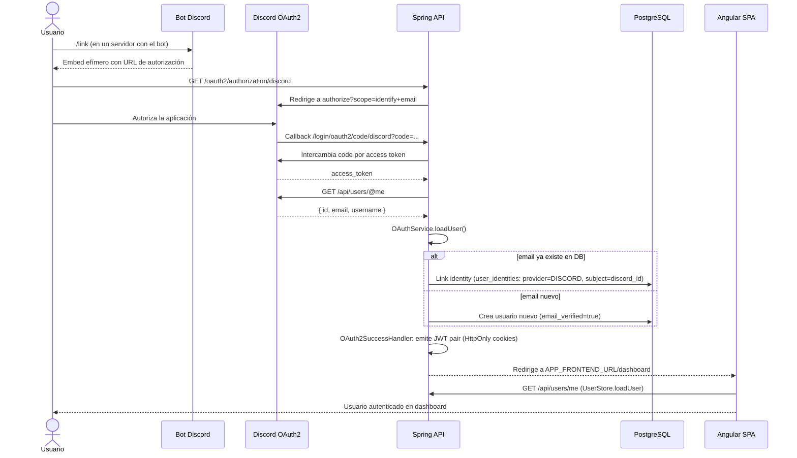

# OAuth Discord: Vinculación de cuenta

Discord se usa en Parallax Sports de dos formas distintas:

1. **Login social:** El usuario puede autenticarse con su cuenta de Discord (Spring Security OAuth2).
2. **Canal de notificaciones:** El bot de Discord envía alertas al usuario en DM o en un canal de guild.

Para recibir notificaciones por Discord, el usuario debe vincular su cuenta de Discord a su perfil de Parallax Sports.

## Diagrama de secuencia: vinculación desde Discord



## Vinculación desde Discord (comando `/link`)

1. El usuario escribe `/link` en un servidor donde está el bot de Parallax Sports.
2. El bot responde con un embed **efímero** (solo visible para el usuario) que contiene la URL de autorización:
   ```
   https://parallax.example.com/oauth2/authorization/discord
   ```
3. El usuario hace clic y es redirigido al endpoint de Spring OAuth2.
4. Spring redirige a Discord con los scopes `identify` y `email`.
5. El usuario autoriza en Discord → Discord redirige al callback de Spring.

## Procesado en Spring

### `OAuthService.loadUser()`

Obtiene del access token de Discord:

- `discord_id` (campo `id`)
- `email` del usuario

### `OAuthUserProvisioningService.provisionUser()`

| Caso                                   | Acción                                                                                |
| -------------------------------------- | ------------------------------------------------------------------------------------- |
| El email ya existe en la base de datos | Inserta fila en `user_identities` (`provider=DISCORD`, `provider_subject=discord_id`) |
| Email desconocido                      | Crea un usuario nuevo con `email_verified=true` (Discord ya verificó el email)        |

### `OAuth2SuccessHandler`

Emite el par JWT (access token + refresh token) en cookies **HttpOnly** y redirige a `APP_FRONTEND_URL/dashboard`.

## Vinculación desde Angular Settings

El usuario ya tiene sesión activa en la SPA:

1. Settings → Account → "Vincular Discord"
2. El navegador hace `GET /oauth2/authorization/discord` → mismo flujo OAuth2.
3. Spring detecta la sesión existente → **solo inserta la identity**, no crea un nuevo usuario ni emite nuevo JWT.

## Diferencia: login social vs. vinculación

| Situación         | Resultado                                                            |
| ----------------- | -------------------------------------------------------------------- |
| Sin sesión activa | `provisionUser()` crea o vincula usuario → inicio de sesión completo |
| Con sesión activa | Spring detecta sesión → solo añade la identity a la cuenta existente |

## Gestión de identidades vinculadas

Las identidades vinculadas son visibles en **Settings → Account → Proveedores vinculados**.

```
DELETE /api/users/identities/{id}
```

Restricciones:

- No es posible desvincular **todas** las identidades si es el único método de acceso a la cuenta.
- Spring valida que el usuario tenga al menos otro método de autenticación activo antes de permitir la desvinculación.
