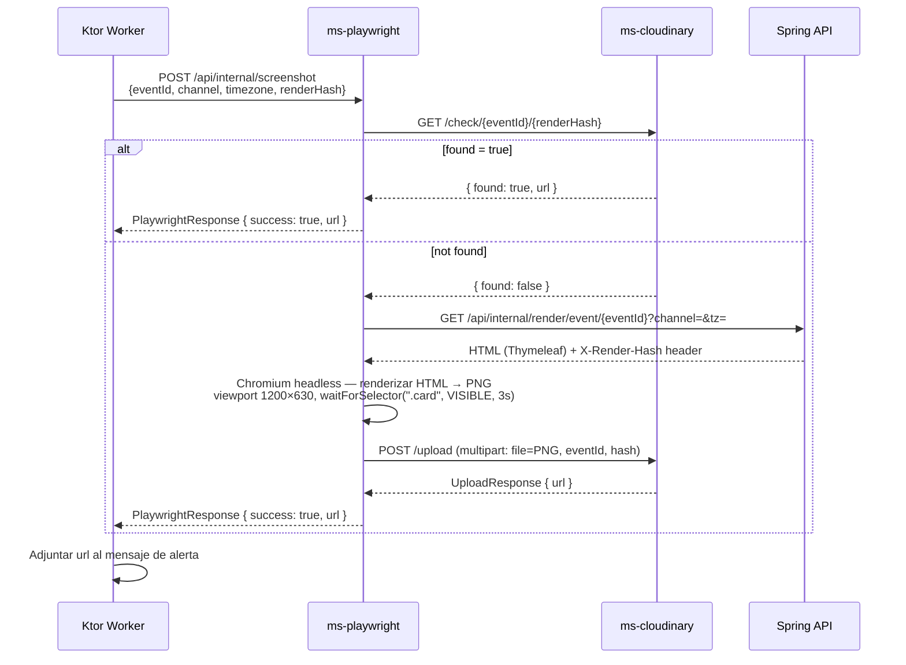

# Pipeline de artefactos

Cuando una alerta tiene `artifact_required = true`, el Ktor worker llama al pipeline antes de enviar el mensaje al proveedor final. El pipeline genera una imagen del evento y la almacena en Cloudinary con caché por render hash.

## Diagrama de secuencia



## Trigger

`PlaywrightClient` (módulo `common`) se invoca desde el Ktor worker cuando `message.artifactRequired = true`.

Llamada: `POST ms-playwright:8087/api/internal/screenshot`

```json
{
  "eventId": "...",
  "channel": "DISCORD | EMAIL",
  "timezone": "Europe/Madrid",
  "renderHash": "sha256-previo-opcional"
}
```

## Paso 1 — Check caché en Cloudinary

`ms-playwright` consulta primero si el artefacto ya existe:

```
GET ms-cloudinary:8085/check/{eventId}/{renderHash}
```

- Si `found = true` → devuelve la URL cacheada inmediatamente, **sin renderizar**.
- Si `found = false` → continúa con el render.

## Paso 2 — Obtener HTML desde Spring

```
GET spring-boot:8080/api/internal/render/event/{eventId}?channel={channel}&tz={timezone}
```

- Spring responde con el HTML generado por el template Thymeleaf del evento.
- La cabecera de respuesta `X-Render-Hash` contiene el SHA-256 del contexto de render.
- Este hash se usa como clave efectiva de almacenamiento (puede diferir del `renderHash` de la request).

## Paso 3 — Captura con Playwright

`PlaywrightService.renderHtmlToImage(html)`:

- Navegador: Chromium headless.
- Viewport: **1200 × 630 px**.
- Espera: `waitForSelector(".card", VISIBLE, timeout=3s)` — garantiza que el contenido está renderizado antes de capturar.
- Salida: PNG en bytes.

## Paso 4 — Upload a Cloudinary

```
POST ms-cloudinary:8085/upload
Content-Type: multipart/form-data

file=<PNG bytes>
eventId=<id>
hash=<X-Render-Hash>
```

- Se almacena en la ruta `parallaxbot/events/{eventId}_{hash}`.
- `overwrite = false` → operación idempotente.
- Devuelve `UploadResponse { url }`.

## Paso 5 — Respuesta al worker

`ms-playwright` responde con `PlaywrightResponse { success: true, url }`.

El Ktor worker adjunta la URL al payload del mensaje antes de llamar al proveedor final (Discord embed / adjunto de email).

## Render hash

El render hash garantiza que el mismo evento con el mismo contexto siempre reutiliza el artefacto cacheado.

Se calcula como SHA-256 sobre la concatenación de:

```
eventId + sportKey + status + template + timezone
```

Si cualquiera de estos campos cambia (p. ej. el status del evento pasa a `LIVE`), se genera un nuevo hash y se produce un nuevo render.

## Fuentes
