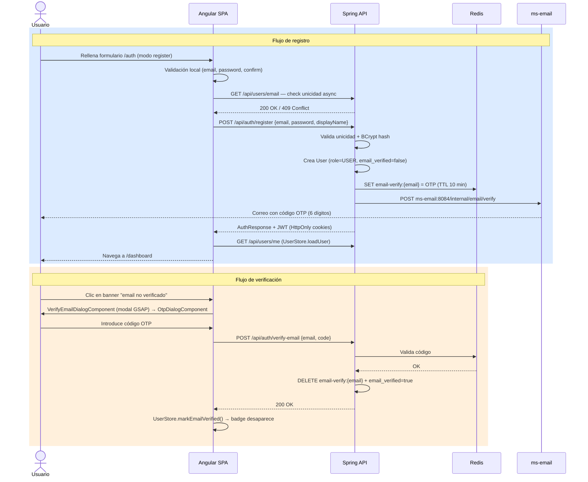

# Registro de usuario

El flujo se divide en dos partes: el **registro** inicial (que emite un JWT y envía el OTP por email) y la **verificación** del email (que el usuario puede completar en cualquier momento posterior).

## Diagrama de secuencia



## Flujo de registro

### 1. Validación en cliente

Angular valida el formulario localmente antes de enviar:

- Formato de email (pattern RFC 5322 básico).
- Longitud mínima de contraseña.
- Confirmación de contraseña coincide.

Adicionalmente, valida el email de forma **asíncrona**:

```
GET /api/users/email?email={email}
→ 200 si disponible
→ 409 si ya existe
```

### 2. Petición de registro

```
POST /api/auth/register
{
  "email": "...",
  "password": "...",
  "displayName": "..."
}
```

### 3. Procesado en Spring

1. Revalida unicidad del email en base de datos.
2. Genera el hash BCrypt de la contraseña.
3. Crea el `User` con `role = USER` y `email_verified = false`.
4. Genera un código OTP de 6 dígitos y lo almacena en Redis:
   - Clave: `email-verify:{email}`
   - TTL: **10 minutos**
5. Llama a `EmailVerificationClient` → `POST ms-email:8084/internal/email/verify`.
6. Emite el par JWT (access token + refresh token) en cookies **HttpOnly**.
7. Devuelve `AuthResponse`.

### 4. En el cliente post-registro

`UserStore.loadUser()` carga el perfil del usuario y la SPA navega a `/dashboard`.

## Flujo de verificación de email

### Banner y modal

Mientras `email_verified = false`, Angular muestra:

- Banner persistente en la parte superior del dashboard.
- Badge en Settings → Account.

Al hacer clic, se abre `VerifyEmailDialogComponent` (animado con GSAP), que contiene `OtpDialogComponent`.

### Verificación del código

```
POST /api/auth/verify-email
{
  "email": "...",
  "code": "123456"
}
```

Spring:

1. Recupera el código de Redis (`GET email-verify:{email}`).
2. Compara con el código enviado.
3. Si es válido: elimina la clave de Redis y pone `email_verified = true` en la base de datos.

### Actualización en cliente

`UserStore.markEmailVerified()` actualiza el estado local. El banner y el badge desaparecen sin recargar la página.

## Rate limiting

| Acción                   | Límite                          |
| ------------------------ | ------------------------------- |
| Intentos de verificación | Máximo 5 antes de lockout       |
| Reenvío del código       | Cooldown de 60 s entre reenvíos |

Reenvío: `POST /api/auth/resend-verification`

## Limpieza de cuentas no verificadas

`UnverifiedUserCleanupScheduler` se ejecuta periódicamente y elimina los usuarios cuyo email sigue sin verificar transcurrido el período de gracia configurado. Esto evita la acumulación de cuentas fantasma en la base de datos.

## Fuentes
