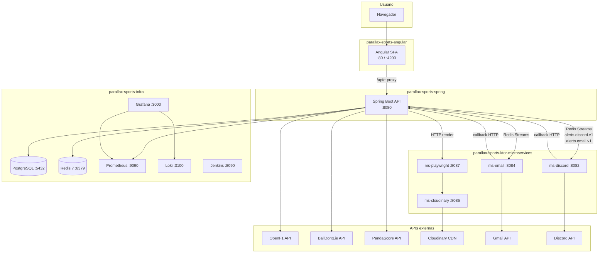

# Arquitectura

El proyecto está dividido en cuatro repositorios con responsabilidades independientes. La comunicación interna se hace mediante Redis Streams y HTTP; externamente consume APIs deportivas de terceros.

## Diagrama general

## Repositorios

| Repositorio                          | Tecnología               | Función                                           |
| ------------------------------------ | ------------------------ | ------------------------------------------------- |
| `parallax-sports-angular`            | Angular 21, NgRx Signals | SPA — interfaz de usuario                         |
| `parallax-sports-spring`             | Spring Boot 4, Java 21   | API REST central, lógica de negocio               |
| `parallax-sports-ktor-microservices` | Ktor 3.4.1, Kotlin 2.3.0 | Workers de alertas por canal                      |
| `parallax-sports-infra`              | Docker Compose           | Infraestructura: BD, cache, observabilidad, CI/CD |

## Flujo de datos principal

1. **Sincronización** — Spring ejecuta jobs diarios contra OpenF1, BallDontLie y PandaScore. Los eventos se almacenan en PostgreSQL.
2. **Generación de alertas** — Tras ingestar eventos, Spring calcula qué usuarios deben recibir alertas y a qué hora (`send_at_utc`).
3. **Dispatch** — Un scheduler corre cada minuto. Las alertas vencidas se publican en los Redis Streams por canal (`alerts.discord.v1`, `alerts.email.v1`).
4. **Consumo** — Los microservicios Ktor consumen sus streams con consumer groups. Cada worker entrega la alerta al proveedor (Discord/Gmail) y reporta el resultado a Spring.
5. **Artefactos** — Si la alerta requiere imagen, ms-playwright rende­riza un HTML de Spring, hace screenshot con Chromium headless y sube la imagen a Cloudinary. El worker Discord/Email usa la URL resultante.

## Comunicación interna

| Canal                         | Usado por                            | Protocolo             |
| ----------------------------- | ------------------------------------ | --------------------- |
| Redis Streams                 | Spring → Discord/Email workers       | `XADD` / `XREADGROUP` |
| HTTP `/api/internal/*`        | Ktor workers → Spring (callbacks)    | REST con `X-Api-Key`  |
| HTTP `/api/internal/render/*` | ms-playwright → Spring (render HTML) | REST con `X-Api-Key`  |
| HTTP `/check`, `/upload`      | ms-playwright → ms-cloudinary        | REST                  |

## Fuentes
